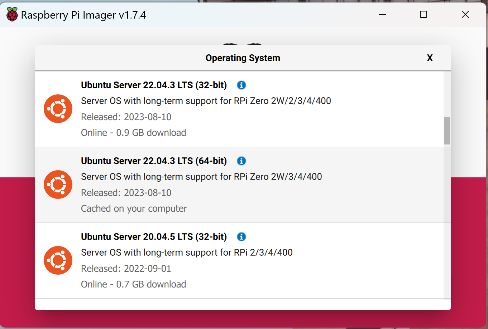

# Install Ubuntu 22.04 Server for the companion computer

Flash the Image from Raspberry Pi Imager. Choose Ubuntu 22.04 server like this image example:



## Install steps

```bash
sudo apt update
sudo apt-get install openssh-server
sudo systemctl enable ssh
```
Remember to turn off the sleep mode and turn on the automatic login.
Now you can use ssh from your PC

```bash
sudo apt-get install git python3-pip python3-schedule raspi-config wget curl -y
pip install RPi.GPIO
```

Then open the tool using
```bash

sudo raspi-config
```
Once the tool screen is opened, go to Interface Options and then enable "Legacy camera option".

#### Enable Camera

```bash
sudo usermod -aG video USER-NAME
sudo nano boot/firmware/config.txt
start_x = 1 # Add this line at the bottom

# From command line, you could use vcgencmd utility as shown below:
vcgencmd get_camera
supported=1 detected=1, libcamera interfaces=0

# When no camera detected the output would be:
vcgencmd get_camera
supported=0 detected=0
```

```bash
mkdir -p ~/colcon_ws/src
cd ~/colcon_ws
git clone https://github.com/TPODAvia/Autonomous-Tractor.git src

cd ~/colcon_ws/src

chmod +x ROS2-installation/ROS2_server.sh
sudo ./ROS2-installation/ROS2_server.sh

echo "source /opt/ros/humble/setup.bash" >> ~/.bashrc
```
#### Encrease swap file:

See this instructions for the details https://www.digitalocean.com/community/tutorials/how-to-add-swap-space-on-ubuntu-22-04

### Add watchdog

Activate the hardware watchdog on your Raspberry Pi. With the command `sudo nano /boot/firmvare/config.txt`, add the following line to enable the watchdog:

```bash
dtparam=watchdog=on
```

Reboot your Raspberry Pi. After the reboot, you can check if the watchdog is enabled by running the command `ls -al /dev/watchdog*`. You should see output similar to this:

```bash
crw------- 1 root root  10, 130 May 19 07:09 /dev/watchdog
crw------- 1 root root 253,   0 May 19 07:09 /dev/watchdog0
```
This indicates that the watchdog is enabled.

Install the watchdog software package with the command `sudo apt-get install watchdog`.

Configure the watchdog package. Edit the configuration file with the command `sudo nano /etc/watchdog.conf` and uncomment or add the following lines:

```bash
max-load-1 = 24
min-memory = 1
watchdog-device = /dev/watchdog
watchdog-timeout=15
```

Start the watchdog service with the command `sudo systemctl start watchdog` and enable it to start at boot with the command `sudo systemctl enable watchdog`.

Verify that the watchdog service is running with the command `sudo systemctl status watchdog`. If it's running correctly, you should see output indicating that the service is active.

### Install ORB-SLAM3

```bash
sudo apt-get update
sudo apt-get install libboost-all-dev libboost-dev libssl-dev libpython2.7-dev libeigen3-dev libunwind-dev python3-rosdep2 ros-humble-vision-opencv ros-humble-message-filters ros-humble-v4l2-camera -y
# sudo apt-get install libdc1394-dev

cd
git clone https://github.com/TPODAvia/ORB-SLAM3-STEREO-FIXED.git ORB_SLAM3
cd ORB_SLAM3
chmod +x build.sh
./build.sh
https://github.com/astronaut71/orb_slam3_ros2

```
### Install OpenCV

```bash
# wget https://github.com/Qengineering/Install-OpenCV-Raspberry-Pi-32-bits/raw/main/OpenCV-4-5-5.sh
cd ~/colcon_ws/src
sudo chmod 755 /ROS2-installation/OpenCV-4-5-5.sh
./ROS2-installation/OpenCV-4-5-5.sh
```

### Check I2C and USB port

```bash
sudo apt-get install i2c-tools python3-smbus libi2c-dev
sudo adduser ubuntu i2c
i2cdetect -y -r 1
sudo i2cget -y 1 0x68 0x75
sudo chmod 777 /dev/ttyUSB0
```

### Compile ROS2 project

```bash
cd ~/colcon_ws/src

git clone https://github.com/TPODAvia/orb_slam3_ros2.git orbslam3_ros2

git clone https://github.com/cra-ros-pkg/robot_localization.git
cd robot_localization
git checkout humble-devel
cd ..

git clone https://github.com/RobotWebTools/web_video_server.git
cd web_video_server
git checkout ros2
cd ..

git clone https://github.com/ros2/teleop_twist_keyboard.git

git clone https://github.com/orascheg/ros2GPSx.git

git clone https://github.com/hiwad-aziz/ros2_mpu6050_driver.git

git clone https://github.com/nobleo/full_coverage_path_planner.git
cd full_coverage_path_planner
git checkout ros2

cd ~/colcon_ws
echo "source ~/colcon_ws/install/setup.bash" >> ~/.bashrc
rosdep install --from-paths src --ignore-src -r -y
colcon build --symlink-install --packages-select orbslam3
colcon build
```

### Always On mode

To disable the sleep mode and allow automatic login in Ubuntu using the terminal, follow the steps below:

1. **Disable Sleep Mode**

To disable the sleep mode in Ubuntu, you can use the `systemctl` command to mask the sleep, suspend, hibernate, and hybrid-sleep targets. This essentially links these unit files to /dev/null, making it impossible for the system to start them [Source 2](https://askubuntu.com/questions/47311/how-do-i-disable-my-system-from-going-to-sleep).

You can execute the following command:

```bash
sudo systemctl mask sleep.target suspend.target hibernate.target hybrid-sleep.target
```

Keep in mind that this command will completely disable sleep mode, meaning your system will stay awake indefinitely until you manually put it to sleep or shut it down.

2. **Enable Automatic Login**

To enable automatic login, you'll need to edit the `custom.conf` file in the `/etc/gdm3/` directory. Here is how you can do it:

First, open the file using a text editor such as `nano`.

```bash
sudo nano /etc/gdm3/custom.conf
```

Find the section in the file labeled `[daemon]`. In this section, uncomment (or add if it's not there) the line `AutomaticLoginEnable=true` and the line `AutomaticLogin=[your username]`, replacing `[your username]` with your actual username.

Here is how it should look:

```bash
[daemon]
AutomaticLoginEnable=true
AutomaticLogin=john_doe
```

After making the changes, press `Ctrl+X` to exit and `Y` to save the changes. Then, restart your system for the changes to take effect.

Please note that enabling automatic login can pose a security risk as anyone who can access your computer will be able to turn it on and have immediate access to your files and data.

3. **Handle Lid Close Action**

In some cases, you might want to change the action that Ubuntu takes when the laptop lid is closed. To do this, you can edit the `/etc/systemd/logind.conf` file [Source 9](https://www.dell.com/support/kbdoc/en-us/000179566/how-to-disable-sleep-and-configure-lid-power-settings-for-ubuntu-or-red-hat-enterprise-linux-7).

Open the file using a text editor:

```bash
sudo nano /etc/systemd/logind.conf
```

Find the line that starts with `#HandleLidSwitch=suspend` and change it to `HandleLidSwitch=ignore`. This will make Ubuntu do nothing when the laptop lid is closed.

Here is how it should look:

```bash
HandleLidSwitch=ignore
```

To prevent Ubuntu from going into suspend mode and turning on the lock screen, you can use the following steps:

4. **Disable Automatic Lock Screen**

To disable the automatic lock screen, you need to change the settings of the GNOME desktop. You can do this using the `gsettings` command. The following command will disable the lock screen:

```bash
gsettings set org.gnome.desktop.session idle-delay 0
gsettings set org.gnome.desktop.screensaver lock-enabled false
```

This command will prevent the lock screen from appearing due to inactivity [Source 2](https://askubuntu.com/questions/1029696/disable-password-request-from-suspend-18-04).

5. **Disable Lock Screen Upon Suspend**

In addition to disabling the automatic lock screen, you may also want to disable the lock screen that appears after your system wakes up from suspend. You can do this with the following `gsettings` command:

```bash
gsettings set org.gnome.desktop.screensaver ubuntu-lock-on-suspend false
```

This command will prevent the lock screen from appearing after suspend [Source 2](https://askubuntu.com/questions/1029696/disable-password-request-from-suspend-18-04).


After making the change, save and close the file, then restart the `systemd-logind` service by running:

```bash
sudo reboot
```

Please keep in mind that these changes should be made carefully as they can significantly alter the behavior of your system. Always make sure to backup any files you edit in case you need to revert the changes.
Again, please note that disabling the lock screen and suspend mode can pose a security risk. Anyone with access to your computer will be able to use it without having to enter a password. Please use these commands responsibly.

### How to use

```bash
ros2 run teleop_twist_keyboard teleop_twist_keyboard
cd ~/colcon_ws
ros2 launch main_pkg 0camera.launch.py
ros2 launch main_pkg 3web_control.launch.py

cd /home/ubuntu/colcon_ws/src/orbslam3_ros2/vocabulary/
tar -xf ORBvoc.txt.tar.gz
cd
ros2 run orbslam3 mono /home/ubuntu/colcon_ws/src/orbslam3_ros2/vocabulary/ORBvoc.txt /home/ubuntu/colcon_ws/src/orbslam3_ros2/config/monocular/TUM1.yaml
```