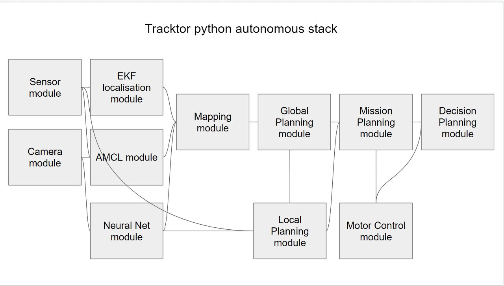

# Autonomous Tracktor Architecture

TODO:
- [ ] Sensor reading, sensor filtering, sensor fusion
- [ ] Localization module
- [ ] Neural network module
- [ ] Mapping module
- [x] Global planner module
- [x] Local planner module
- [ ] Mission module
- [ ] Decision module
- [x] Motor driver module

### using virtualenv (recommend)

virtualenv voiceassistant.venv
source voiceassistant.venv/bin/activate

### To install all needed python libraries run:

sudo /usr/bin/python3 -m pip install -r ~/Autonomous-Tractor/requirements.txt

sudo apt install -y python3-scipy
sudo apt install -y python3-opencv
pip install dynamic-window-approach

### Usage

Autopilot Mode:
/bin/python3 ~/Autonomous-Tractor/core.py

Manual + FPV Mode:
/bin/python3 ~/Autonomous-Tractor/Decision/server.py
/bin/python3 ~/Autonomous-Tractor/Decision/client.py